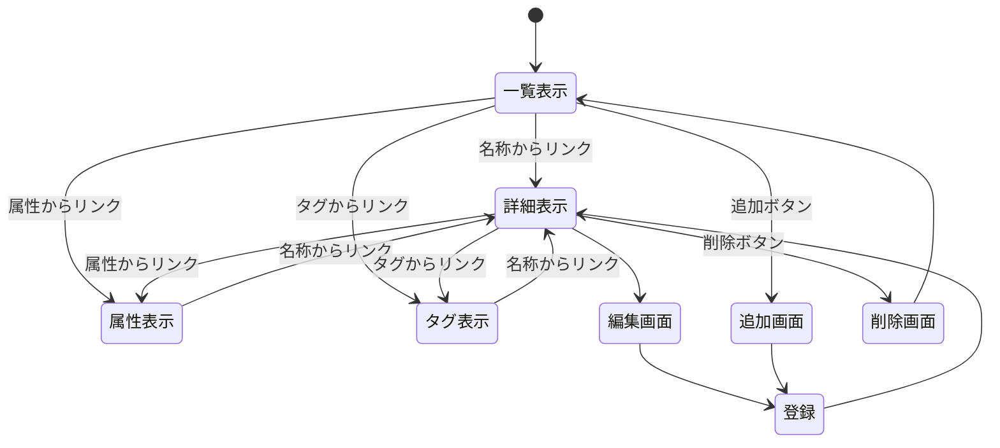

# ドラゴンボールレジェンズシステムの開発者用仕様書(仮)

## はじめに

このシステムは，バンダイナムコエンターテインメントが運営する「DRAGONBALL LEGENDS」というゲームアプリに登場するキャラクターをまとめたものである．以下にシステムのページ遷移図を示す．

```mermaid
stateDiagram-v2
    [*] --> 一覧表示
    一覧表示 --> 詳細表示: 名称からリンク
    一覧表示 --> 属性表示: 属性からリンク
    一覧表示 --> タグ表示: タグからリンク
    属性表示 --> 詳細表示: 名称からリンク
    タグ表示 --> 詳細表示: 名称からリンク
    詳細表示 --> 属性表示: 属性からリンク
    詳細表示 --> タグ表示: タグからリンク
    詳細表示 --> 編集画面
    編集画面 --> 登録
    登録 --> 詳細表示
    一覧表示 --> 追加画面: 追加ボタン
    追加画面 --> 登録
    詳細表示 --> 削除画面: 削除ボタン
    削除画面 --> 一覧表示
```